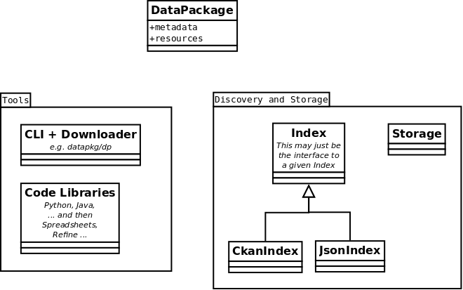

==============
Datapkg Design
==============

Overview
========

The following diagram gives a conceptual overview of the dpm system. Most,
though not all, of the classes indicated already exist within dpm.

The central object in dpm is a **Package**. A Package consists of:

  * metadata
  * payload

One important thing to emphasize is that in dpm the payload is often not
directly available (since it may be very large) but is virtual, being
represented by, for example, links to the payload or a listing of the items in
the payload (the manifest). In addition to the basic metadata about a package
(name, version, title, description etc) we also need to record things like
dependencies. Thus a Package main attributes become:

  * basic
  * dependencies
  * manifest

Distributions are serialized Package on disk (or elsewhere) and handle all
serialization and deserialization of packages.

  * Other people can provide plugins (dpm.distribution)
  * These are tried in turn when loading from disk

Tools include downloaders, unpacking and the command line interface.

An Index represents a list of packages whether locally (like DbIndex) or
remotely (like CkanIndex). A Repository is an Index plus storage/installation
capacity.

Distributions and Metadata
==========================

See http://ckan.org/wiki/DatapkgDistribution

